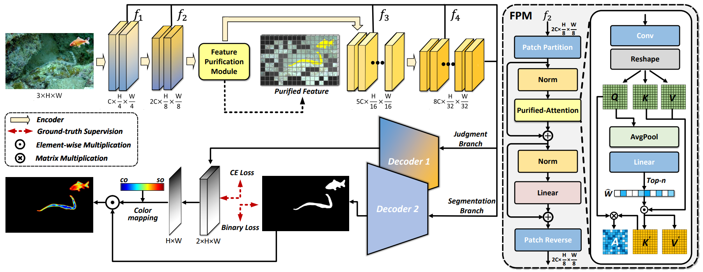
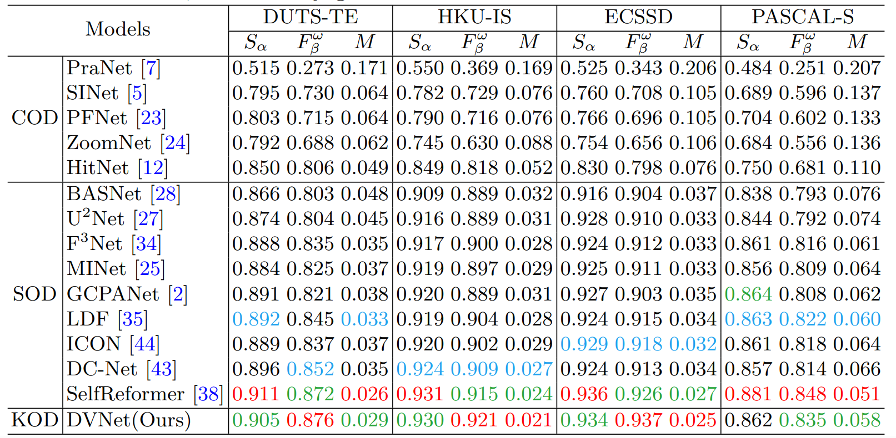
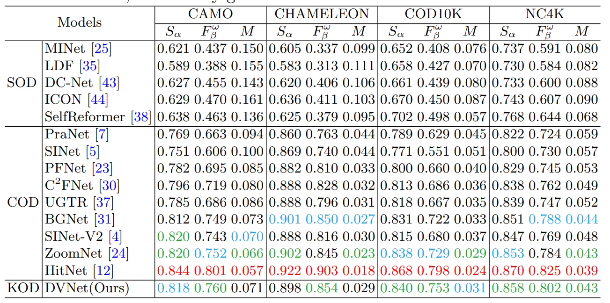
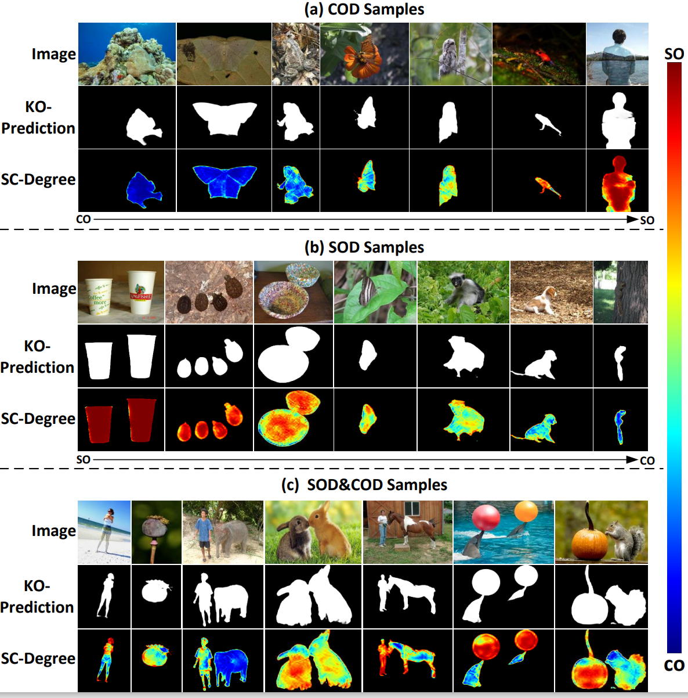

# KOD-DVNet 

Key Object Detection: Unifying Salient and Camouflaged Object Detection into One Task


# Requirements
* Python 3.8.3 <br>
* Torch 1.10.0 <br>
* Torchvision 0.10.0 <br>
* Cuda 11.1 <br>

## Overall Framework


## Dataset
**Download Datasets**：[Baidu | Fetch code:ntd1](https://pan.baidu.com/share/init?surl=R8FytbGt7w1LpwxLUKashg&pwd=ntd1)

**TrainDataset** contains the filtered COD training data and the unified dataset constructed in this study. Since the SOD training data has not been filtered, it is not provided here.

**TestDataset** contains the KOD10K test set constructed in this study, with data sourced from the existing COD and SOD test sets.

## Results

**Evaluation.** You can download the pre-trained model weights via this link: [Baidu | Fetch code: i4m9](https://pan.baidu.com/s/15OsMmxdI2w4Y1p2ynZM--Q). Then, please update the `--pth_path` parameter in the MyTesting.py file to point to the downloaded weights, and finally run MyTesting.py to evaluate the model.(The backbone weights file pvt_v2_b2.pth can be downloaded from the following link: [Baidu | Fetch code: ckx8](https://pan.baidu.com/s/1e_FaBHMgRRkUbFKc4N6Dog?pwd=ckx8).

1. Performance comparison with benchmark SOD models. The best scores were marked red, followed by green and blue.

2. Performance comparison with benchmark COD models. The best scores were marked red, followed by green and blue.

3. Visualization of the predicted results is presented in three groups.


## Citation
```bibtex
@inproceedings{yin2024key,
  title={Key Object Detection: Unifying Salient and Camouflaged Object Detection Into One Task},
  author={Yin, Pengyu and Fu, Keren and Zhao, Qijun},
  booktitle={Chinese Conference on Pattern Recognition and Computer Vision (PRCV)},
  pages={536--550},
  year={2024},
  organization={Springer}
}

